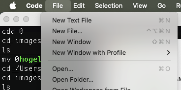
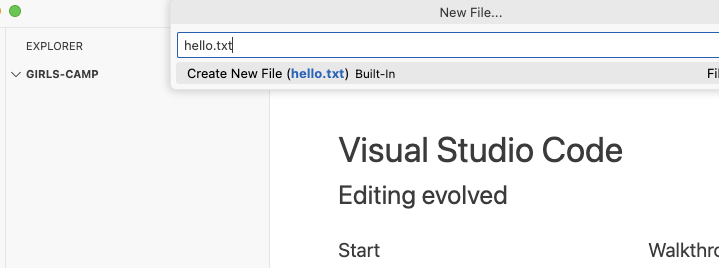

# セットアップ

この章では、ワークショップでプログラミングをするための環境をセットアップしていきます。

- MacOSの場合
  - Command Line Toolsのインストール
  - Homebrewのインストール
  - nvmのインストール
  - Node.jsのインストール
  - Visual Studio Codeのインストール
- Windowsの場合
  - nvm-windowsのインストール
  - Node.jsのインストール
  - Visual Studio Codeのインストール

を行います。

## MacOSの場合

### Command Line Toolsのインストール

MacOSでプログラミングをするためには、Command Line Toolsをインストールする必要があります。

以下のコマンドを実行します。

```
xcode-select --install
```

### Homebrewのインストール

HomebrewはMacOSのパッケージマネージャーです。開発で必要なツールをインストールするために使います。

以下のコマンドを実行します。

```
/bin/bash -c "$(curl -fsSL https://raw.githubusercontent.com/Homebrew/install/HEAD/install.sh)"
```

### nvmのインストール

nvmはNode.jsのバージョンを管理するためのツールです。

以下のコマンドを実行します。

```
brew install nvm
```

### Node.jsのインストール

nvmを使ってNode.jsをインストールします。

```
nvm install 22
```

### Visual Studio Codeのインストール

Visual Studio Codeは無料で使えるエディターです。

https://code.visualstudio.com/download からインストーラーをダウンロードしてインストールします。

## Windowsの場合

### nvm-windowsのインストール

nvm-windowsはnvmのWindows版です。nvmはNode.jsのバージョンを管理するためのツールです。

https://github.com/coreybutler/nvm-windows/releases からインストーラーをダウンロードしてインストールします。

### Node.jsのインストール

nvm-windowsを使ってNode.jsをインストールします。

```
nvm install 22
```

### Visual Studio Codeのインストール

Visual Studio Codeは無料で使えるエディターです。

https://code.visualstudio.com/download からインストーラーをダウンロードしてインストールします。

## Visual Studio Codeを使ってみる

Visual Studio Code (VS Code) を使ってみましょう。

世の中には様々なプログラミングのためのエディターがありますが、Visual Studio Codeは無料で使える非常に人気のあるエディターです。

### VS Codeでテキストファイルを作成してみる
- VS Codeで camp-website という名前のディレクトリを作成し、開いてみましょう
  
- 作成したディレクトリに hello.txt というファイルを作成して、`Hello, World!` と書いて保存してみましょう
  

### Tips
- VS Codeの表示を日本語にするには以下の手順を参考にしてください
  - <https://code.visualstudio.com/docs/getstarted/locales>
- VS Codeのより発展的な使い方については以下のドキュメントを参考にしてください
  - <https://code.visualstudio.com/docs>
