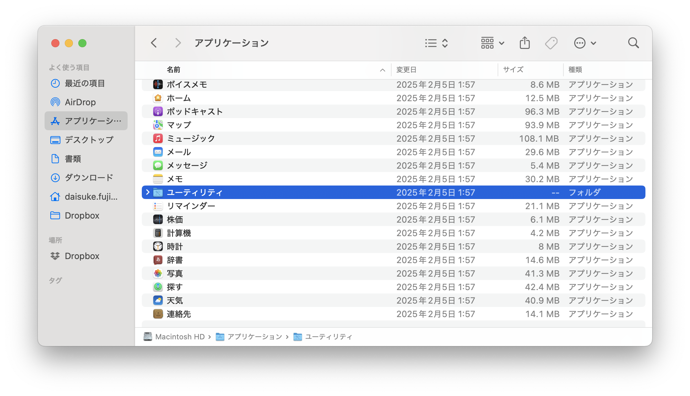
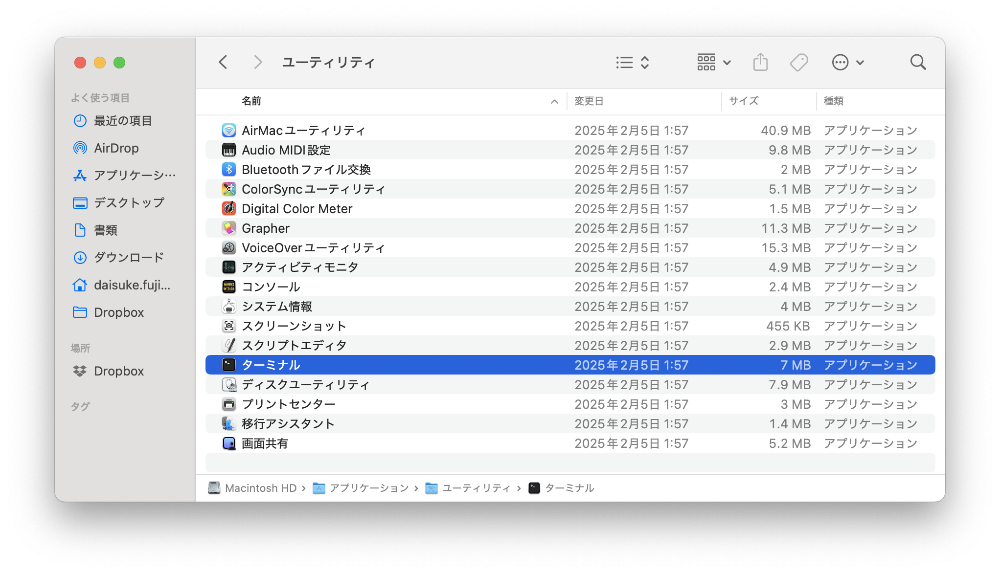

# 1. 商品をひとつ表示しよう

今回のワークショップでは簡単なECサイトを作ります！

## やること

はじめにNext.jsのプロジェクトを作りましょう。

まずはプロジェクトの置き場を作り、そこに移動しましょう。ターミナルで下記のコマンドを一行づつ実行します。

### ターミナルについて

ターミナル（またはコマンドライン）は、テキストベースでコンピュータを操作するためのツールです。普段使っているマウスでクリックする操作の代わりに、コマンドを入力して操作します。

Macの場合はファインダーでアプリケーション→ユーティリティ→ターミナルを開くと起動できます。




Windowsの場合はエクスプローラーでターミナルを開くと起動できます。

主なコマンドの使い方：
- `mkdir フォルダ名`：新しいフォルダを作成します
- `cd フォルダ名`：指定したフォルダに移動します
- `ls`：現在のフォルダの中身を表示します
- `open .`：現在のフォルダをファインダー（Windowsではエクスプローラー）で開きます

ターミナルの使い方：
1. コマンドを入力します
2. エンターキーを押してコマンドを実行します
3. 実行結果が表示されます
4. 次のコマンドを入力できる状態になります

エラーが表示された場合は、コマンドのスペルミスや、実行する場所が間違っていないかを確認してください。

では、プロジェクトの置き場を作り、そこに移動しましょう。

```bash
mkdir projects
cd projects
```

次に、Next.jsのプロジェクトを作ります。下記のコマンドを実行します。いくつか質問されますが、エンターキーを押していけば大丈夫です。完了したらプロジェクトのディレクトリに移動します。

```bash
npx create-next-app@latest tech-girls-camp-next-js
cd tech-girls-camp-next-js
```

では、起動してみましょう！

```bash
npm run dev
```

http://localhost:3000 にアクセスしてみてください。Next.jsのデフォルトの画面が表示されるはずです。Webアプリケーションの開発が始まります！

その前に開発で使うデータをダウンロードします。下記のURLから最新のSource Codeをダウンロードします。

https://github.com/heyinc/tech-girls-camp-next-js/releases

ダウンロードしたzipファイルを解凍して、下記のファイルとディレクトリを現在いるディレクトリにコピーしてください。`open .` で現在いるディレクトリを開くことができます。

- `tsconfig.json`
- `public/` ディレクトリ
- `items.db`

続いて、`src/data/items.json` を `src/data/items.json` にコピーしてください。

これで準備完了です！

Coach Tip: `src/data/items.json` のコピー先がルートディレクトリになっていないか確認してください。

## やること

まずは空の商品をひとつ表示してみましょう。下記のように `src/app/page.tsx` を変更してください。


では、実際に `src/app/page.tsx` を変更してみましょう。まずは下記のように `src/app/page.tsx` を変更してみてください。

```jsx
export default function Home() {
  return (
    <main className="container mx-auto px-4 py-8">
      <h1 className="text-3xl font-bold mb-8">商品一覧</h1>
      <div className="grid grid-cols-1 md:grid-cols-2 lg:grid-cols-4 gap-6">
        <div className="border rounded-lg overflow-hidden shadow-lg">
          <div className="p-4">
            
            <h2 className="text-xl font-semibold mb-2">タイトル</h2>
            <p className="text-gray-600 mb-2">説明</p>
            <p className="text-xl font-bold text-blue-600">1000円</p>
          </div>
        </div>
      </div>
    </main>
  );
}
```


http://localhost:3000 にアクセスしてみてください。空の商品ページが表示されるはずです。


では、次に実際のデータを使って商品を表示してみましょう。下記のように `src/app/page.tsx` を変更してみてください。


```tsx
import items from "../data/items.json"; //追加

export default function Home() {
  const item = items[0]; //追加
  return (
    <main className="container mx-auto px-4 py-8">
      <h1 className="text-3xl font-bold mb-8">商品一覧</h1>
      <div className="grid grid-cols-1 md:grid-cols-2 lg:grid-cols-4 gap-6">
        <div className="border rounded-lg overflow-hidden shadow-lg">
          <div className="p-4">
            
            <h2 className="text-xl font-semibold mb-2">{item.name}</h2> {/* 変更 */}
            <p className="text-gray-600 mb-2">{item.description}</p> {/* 変更 */}
            <p className="text-xl font-bold text-blue-600">{item.price}円</p> {/* 変更 */}
          </div>
        </div>
      </div>
    </main>
  );
}
```

商品が表示されたら成功です！お疲れ様でした。


## 解説

無事商品を表示できたので、そもそもWebアプリケーションとはなにかと、そこに使われる技術について解説します。

### HTMLとは

HTMLはHyperText Markup Languageの略で、Webページを作るための言語です。`<h1>Hello, World!</h1>` のように、文章を「タグ」で囲むことで、その文章がどのような役割を持つかを指定します。

もともとは文章の表示をきれいにするための仕組みでした。しかし、インターネットの普及に伴い、ブラウザで様々なコンテンツを表示（レンダリング）するための仕組みとして発展してきました。見出しは`h1`(Heading 1、6まであります）、画像は`img`（Image）などのタグで表現します。

### JavaScriptとは

JavaScriptはWebブラウザで動くプログラム言語です。インターネットの普及にともない、ブラウザで動的な（動いたり操作できたりする）画面を表示するようになると、そこで使われるJavaScriptが注目を集めるようになりました。

### TypeScriptとは

TypeScriptはJavaScriptの型付き版で、型を指定することでコードの安全性を高めることができます。

### Reactとは

動的なWebページを効率よく作るためのライブラリです。2013年に登場し、現在ではVue.jsと並んで最もよく使われています。

### Next.jsとは

Next.jsはReactを使ってWebアプリケーションを作るためのフレームワークです。Reactはあくまで画面を作るためのライブラリで、それ単体でアプリケーションを作ることはできません。Next.jsはReactを使ったWebアプリケーションを作るためのフレームワークです。

TODO: この辺全体がわかる図をいれる

### JSX/TSXとは

JSXはHTMLの中にJavaScriptの値を埋め込める仕組みです。プログラムを書いていると、文字の中に何かを埋め込みたくなることがよくあります。これのために「テンプレート」と呼ばれる仕組みがあります。JSXはHTMLに特化したテンプレートの一種で、`{}`（ブレース）を使ってJavaScriptの値を埋め込んでいます。

TSXはTypeScriptの中にJSXを書ける仕組みです。TypeScriptはJavaScriptの型付き版で、型を指定することでコードの安全性を高めることができます。

### items.json

商品のデータは `src/data/items.json` にJSONという形式保存してあります。JSONはデータを扱いやすく保存するのに便利な形式です。ファイルを開いて中身を確認してみましょう。

`import items from "../data/items.json";` でファイルからデータを読み込んでいます。importを使うと他のファイルからプログラムやデータを利用できます。これはモジュールシステムと呼ばれるもので、プログラミング言語によって書き方やり方が異なります。

より便利なデータの形式としてデータベースがあります。これは後のステップで扱います。
