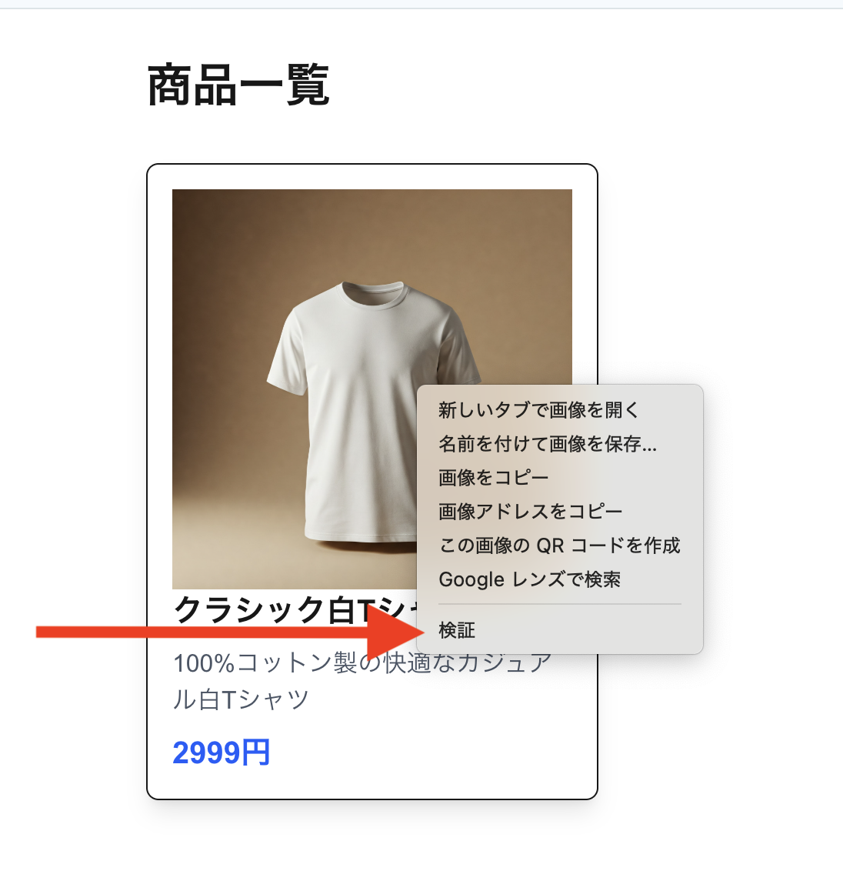
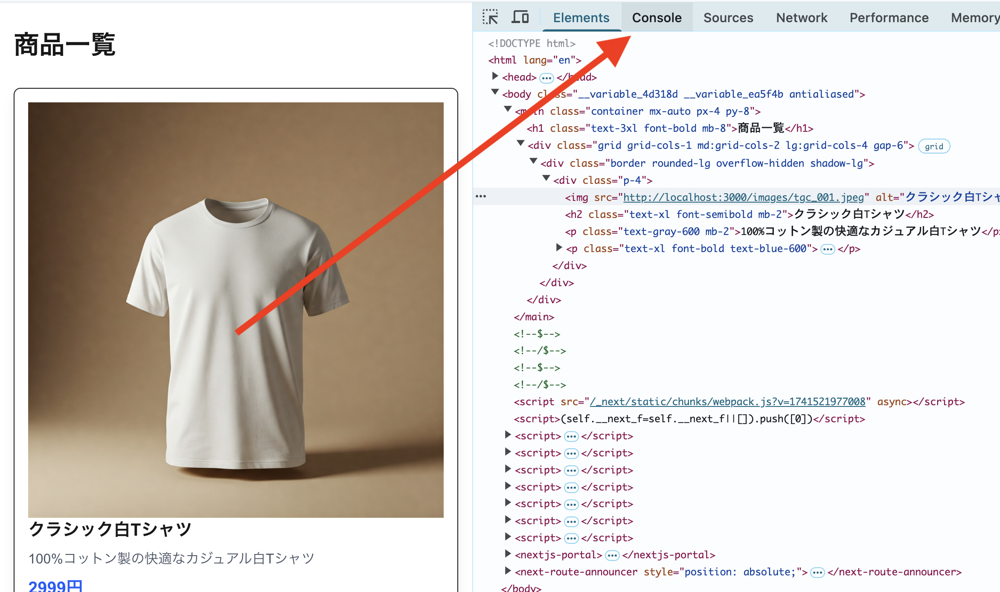

# 2. 商品をすべて表示しよう

まだ一つの商品しか表示できていません。全ての商品を表示してみましょう。

## やること

Arrayのメソッド`map`を使うと、下記のコードのように配列の要素を一つずつ変換して新しい配列を作ることができます。

```ts
[1,2,3,4,5].map((item) => item * 2); // [2, 4, 6, 8, 10]
```

JavaScriptのコードはブラウザのデベロッパーツールで実行することができます。上記のコードを実行してみましょう。
デベロッパーツールは下記のように右クリックして「検証」を選択し、`Console` タブを選択すると開くことができます。





実行できましたか？それでは `map` を使って、下記のように `src/app/page.tsx` を変更して全ての商品を表示しましょう。下記のように `const allItems` を定義して、`items` を `map` で一つづつHTMLで描画してみてください。

```diff
import items from "../data/items.json";

 export default function Home() {
-  const item = items[0];
+  const allItems = items;
   return (
     <main className="container mx-auto px-4 py-8">
       <h1 className="text-3xl font-bold mb-8">商品一覧</h1>
       <div className="grid grid-cols-1 md:grid-cols-2 lg:grid-cols-4 gap-6">
-        <div className="border rounded-lg overflow-hidden shadow-lg" >
+        {allItems.map((item) => (
+          <div key={item.id} className="border rounded-lg overflow-hidden shadow-lg">
           <div className="p-4">
             
             <h2 className="text-xl font-semibold mb-2">{item.name}</h2>
             <p className="text-gray-600 mb-2">{item.description}</p>
             <p className="text-xl font-bold text-blue-600">{item.price}円</p>
           </div>
+          </div>
+        ))}
       </div>
     </main>
   );
```

これで商品を全て出力することができました！

## 解説

### 配列の変換

先ほど述べたとおり、Array.mapを使うと、配列の要素を一つずつ変換して新しい配列を作ることができます。

Arrayにはたくさんのメソッドがあります。MDNに正式なドキュメントがありますので、色々試してみましょう。
https://developer.mozilla.org/ja/docs/Web/JavaScript/Reference/Global_Objects/Array

```ts
[1,2,3,4,5].reverse(); // [5, 4, 3, 2, 1] // 配列を逆順にする
[1,2,3,4,5].filter((item) => item % 2 === 0); // [2, 4] // 偶数の要素だけを取り出す
[1,2,3,4,5].slice(0, 3); // [1, 2, 3] // 最初の3つの要素を取り出す
```
