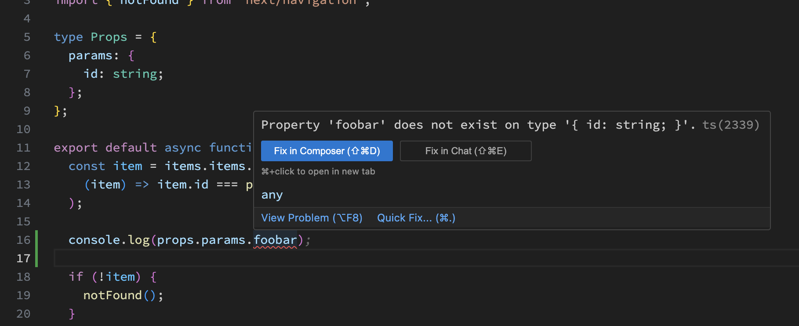

# 3. 商品詳細ページを作ろう

いまは商品をクリックしても何も起きません。商品をクリックしたら商品詳細ページに遷移してみましょう。

## Next.jsでページを作る方法

Webアプリケーションを作る際によくある（というかほとんどの場合）ニーズとして、様々なURLに対してそれに応じた画面を表示する、ということがあります。Webアプリケーションフレームワークはそれぞれの方法でこれを実現します。

Next.jsの場合は、 `src/app` の下にディレクトリ（＝フォルダ）を作り、そこに `page.tsx` という名前のファイルを置くと、そのディレクトリに対応したページを表示できます。例えば `src/app/foo/page.tsx` だと `http://localhost:3000/foo` 、 `src/app/bar/baz/page.tsx` だと `http://localhost:3000/bar/baz` になります。`http://localhost:3000` 、いわゆるルートページに対応するのは、今回変更した `src/app/page.tsx` です。

さて、URLの中に何かしらの変化する（任意の）値を入れたい場合はどうすればよいでしょうか。今回は商品のIDを入れたいですね。このような任意の値を受け入れるURL設計は動的ルーティングと呼ばれます。

動的ルーティングは、Next.jsではディレクトリの一部を`[]`で囲うことで実現できます。今回やろうとしている商品詳細ページは　`src/app/items/[id]/page.tsx` というディレクトリにすればよさそうです。こうすると `http://localhost:3000/items/1`のようなURLのページを実装できます。

## やること

下記のとおり `src/app/items/[id]/page.tsx` を作ります。

```tsx
import items from "../../../data/items.json";

type Props = {
  params: {
    id: string;
  };
};

export default async function ItemDetail(props: Props) {
  const item = items.find((item) => item.id === parseInt(props.params.id));

  if (!item) {
    return (
      <main>
        <h1>商品が見つかりませんでした</h1>
      </main>
    );
  }

  return (
    <main>
      <a href="/">← 商品一覧に戻る</a>
      
      <h1>{item.name}</h1>
      <p>{item.description}</p>
      <p>{item.price.toLocaleString()}円</p>
      <p>カテゴリー: {item.category}</p>
    </main>
  );
}
```

## 解説

### Propsとparams

`props`は`properties`の略で、Reactのコンポーネントに渡すデータのことです。下記のように、コンポーネント（関数）の引数として渡されます。

```ts
export default async function ItemDetail(props: Props) {
```

ここでは`props`に`params`という特別なキーを使っています。`params`は`parameters`の略で、ここからさきほど説明した動的ルーティングで渡された`[id]`の値を取り出すことができます。下記のようにアイテムの取り出しで `props.params.id`というふうに使われています。`find`については後ほど説明します。

```ts
const item = items.find((item) => item.id === parseInt(props.params.id));
```

※ 最新のNext.jsでは、`params`の型は`Promise<{ id: string }>`に変更されました。現在のバージョンでは `{ id: string }` でも動作しますが、将来は動作しない可能性があります。

### Propsの型注釈

```ts
type Props = {
  params: {
    id: string;
  };
};
```

というコードは型注釈というものです。これによって、`props`の「型」を指定することができます。型を指定することで、存在しないキーにアクセスした時にエラーを出してくれるようになります。安定したコードを書く上でとても便利な機能です。実際にVSCodeで下記のように存在しないキーにアクセスしてみましょう。



### findメソッド

`find`メソッドは配列の中から特定の条件を満たす要素を探してくれるメソッドです。デベロッパーツールで下記のように試してみましょう。

```ts
[1,2,3,4,5].find((item) => item === 3); // 3
[1,2,3,4,5].find((item) => item === 6); // undefined
```

今回の実装では、`items` という配列の中から `id` が `props.params.id` と一致する要素を探してくれます。これによって、商品の詳細ページに遷移した時に、その商品のデータを取得することができます。

```ts
const item = items.items.find(
  (item) => item.id === parseInt(props.params.id)
);
```

### 商品が存在しない場合の扱い

存在しない商品にアクセスした場合「ありませんでした」と返したいですね。これは途中で `return` して実現しています。JavaScriptでは `return` した時点で関数が終了するので、その後の処理は実行されません。


```tsx
export default async function ItemDetail(props: Props) {
  const item = items.find((item) => item.id === parseInt(props.params.id));

  if (!item) {
    return (
      <main>
        <h1>商品が見つかりませんでした</h1>
      </main>
    );
  }
```

## やること

最後に、商品一覧ページで商品をクリックしたら商品詳細ページに遷移するようにします。下記のように `src/app/page.tsx` を変更してください。

```tsx
import items from "../data/items.json";

 export default function Home() {
   const allItems = items;
   return (
     <main className="container mx-auto px-4 py-8">
       <h1 className="text-3xl font-bold mb-8">商品一覧</h1>
       <div className="grid grid-cols-1 md:grid-cols-2 lg:grid-cols-4 gap-6">
        {allItems.map((item) => (
          <div key={item.id} className="border rounded-lg overflow-hidden shadow-lg">
           <a href={`/items/${item.id}`}> {/* 追加 */}
           <div className="p-4">
             
             <h2 className="text-xl font-semibold mb-2">{item.name}</h2>
             <p className="text-gray-600 mb-2">{item.description}</p>
             <p className="text-xl font-bold text-blue-600">{item.price}円</p>
           </div>
           </a> {/* 追加 */}
           </div>
         ))}
       </div>
     </main>
   );

```

これで商品一覧と商品詳細を行き来することができるようになりました。


## 解説

### リンク

`a`タグを使うと他のページへのリンクを作れます。リンク先は`href`属性で指定します。

```tsx
<a href="/items/1">商品詳細</a>
<a href="/">商品一覧に戻る</a>
```

### 文字列の埋め込み

JavaScriptでは、文字列の中に変数を埋め込むことができます。下記のように`${}`で囲むと、その中に変数を埋め込むことができます。デベロッパーツールで試してみましょう。

```ts
const name = "みな";
const message = `こんにちは、${name}さん！`;
```

### コンポーネントのネスト

コンポーネントはネストすることができます。下記のように、`src/app/items/[id]/page.tsx` で `src/app/items/[id]/like.tsx` を呼び出すことができます。

```tsx
const Like = () => {
  return <div>いいね！</div>;
};

const ItemDetail = () => {
  return (
    <div>
      ここにいいねボタンを表示します！
      <Like />
    </div>
  );
};
```
