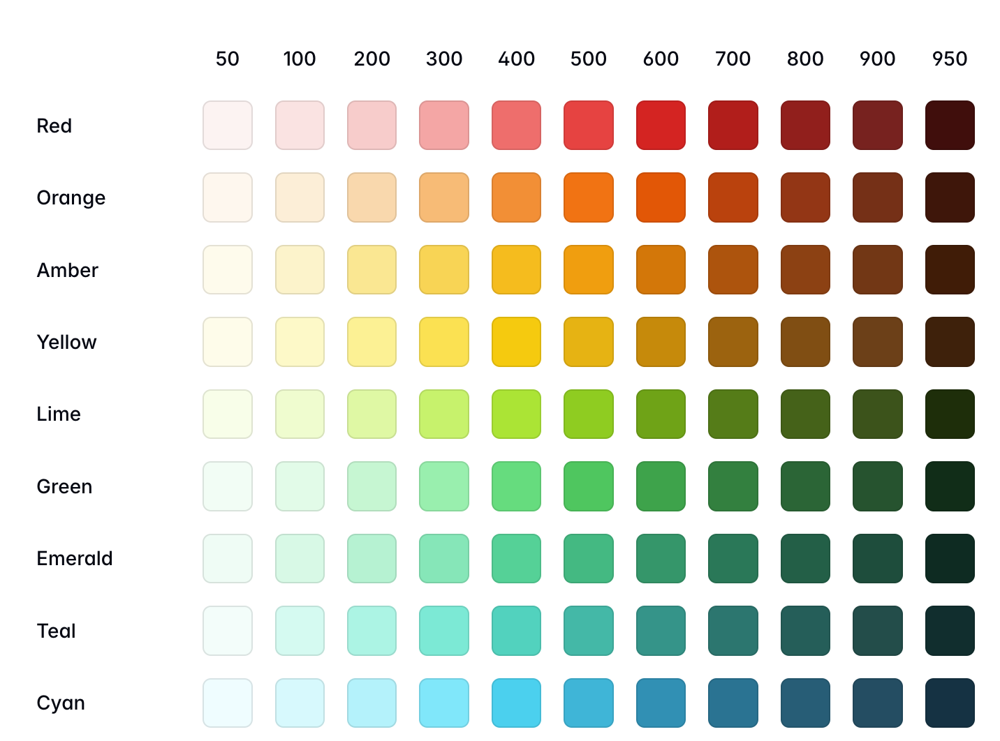

# 4. 商品詳細ページのレイアウトを改善しよう

商品詳細ページのレイアウトが寂しいですね。TailwindCSSを使ってレイアウトを改善してみましょう。

## CSSとTailwindCSSについて簡単に解説

レイアウトの改善の前に、CSSとTailwindCSSについて簡単に解説します。
CSS（Cascading Style Sheets）は、HTMLの要素を装飾するための言語です。HTMLの要素に対して、色、フォント、配置などのスタイルを指定することができます。スタイルの指定はクラス名を指定して適用します。

例：

```css
.item-name {
  font-size: 24px; /* 文字サイズを24pxにする */
  color: #333333; /* 文字色をグレーにする */
}
```


```html
<div class="item-name">商品名</div> <!-- 文字サイズを24pxにしてグレーにする .item-name を div に適用 -->
```

TailwindCSSは、CSSをより便利に使えるようにするためのツールです。CSSを使うときには、クラス名を指定して装飾を適用しますが、TailwindCSSではクラス名を指定することで簡単に好きなスタイルを適用することができます。Next.jsではTailwindCSSを使うための設定がすでにされています。

例：

```html
<div class="text-2xl text-gray-600">商品名</div> <!-- 文字サイズを2xl（24px）にしてグレーにする -->
```


## やること

`src/app/items/[id]/page.tsx` を変更して、商品詳細ページのレイアウトを改善しましょう。`return` の中身をまるごと下記のように変更してください。

```tsx
   return (
     <main className="container mx-auto px-4 py-8">
       <a
         href="/"
         className="inline-block m-4 text-blue-600 hover:text-blue-800"
       >
         ← 商品一覧に戻る
       </a>
       <div className="grid grid-cols-1 md:grid-cols-2 gap-8">
         <div>
           
         </div>
         <div>
         <h1 className="text-3xl font-bold m-1">{item.name}</h1>
         <p className="text-gray-600 m-8">{item.description}</p>
         <div className="bg-blue-100 m-4 p-6 rounded-lg ">
           <p className="text-3xl font-bold text-blue-600">
             {item.price.toLocaleString()}円
           </p>
           <p className="text-gray-600 m-2">カテゴリー: {item.category}</p>
         </div>
       </div>
     </main>
   );
}
```

## 解説

今回指定したクラスの一部について説明しますので、実際にスタイルを変更してみましょう。

### 背景色の指定

背景色を指定するときは `bg-gray-100` のように指定します。これを指定することでCSSの `background-color` を指定することができます。

例：
- `bg-gray-100`: 背景色を灰色（100の濃さ）に設定
- `bg-blue-400`: 背景色を青色（400の濃さ）に設定
- `bg-red-200`: 背景色を赤色（200の濃さ）に設定

価格とカテゴリーを表示している要素のクラスは `bg-gray-100` が指定されていますね。これを `bg-red-100`、`bg-blue-100` などに変更してみてください。

色とクラス名の対応は下記のようになっています。さらにたくさんの色が用意されているので、下記のTailwindCSSのドキュメントを参照してください。



https://tailwindcss.com/docs/colors


### 文字色の指定

文字の色を指定するときは `text-gray-600` のように指定します。これを指定することでCSSの `color` を指定することができます。

例：
- `text-gray-600`: 文字色を灰色（600の濃さ）に設定
- `text-blue-400`: 文字色を青色（400の濃さ）に設定
- `text-red-200`: 文字色を赤色（200の濃さ）に設定

試しに `text-gray-600` を `text-red-600`、`text-blue-600` などに変更してみてください。

### 要素の間のスペース（マージン）

要素の間にスペースを空けたいときは `m-4` のように指定します。これを指定することでCSSの `margin` を指定することができます。

例：
- `m-4`: 全方向に1rem（16px）のマージン
- `mt-4`: 上側に1remのマージン（margin-top）
- `mr-4`: 右側に1remのマージン（margin-right）
- `mb-4`: 下側に1remのマージン（margin-bottom）
- `ml-4`: 左側に1remのマージン（margin-left）
- `mx-4`: 左右に1remのマージン
- `my-4`: 上下に1remのマージン

※ remは文字の大きさを基準にした単位です。`1rem = 16px` です。詳しくは補足説明を参照してください。

上記のコードのスタイル指定は要素の間の感覚がぎこちない感じがします。マージンの指定を修正・追加してきれいに揃えてみましょう。

### カーソルを合わせた時の色の変更

カーソルを合わせた（hover）ときのスタイルを変更することもできます。これは今までやったクラスに`hover:`をつけることで実現できます。

例：
- `hover:text-blue-800`: マウスを乗せたときにテキストをより濃い青色（800）に変更する
- `hover:bg-blue-100`: マウスを乗せたときに背景色を薄い青色（100）に変更する

これにより、リンクにマウスを乗せたときに色が変わり、クリックできることがわかりやすくなります。今回のコードではリンクに `hover:text-blue-800` を指定しています。
試しに色々な要素に`hover:`つきのクラス指定をして遊んでみてください。

### （おまけ）ぷにぷに

`rounded-md border border-gray-300 px-4 py-2 active:scale-95 active:duration-100` を指定すると、カーソルで押さえるとぷにぷにする要素が作れます。好きな要素の適用して試してみてください。

## 更に詳しい説明

マージンとパディングについての説明と、紹介していないスタイルについての説明をします。この節は読み飛ばしても大丈夫です。

### マージン（margin）とは

マージンは要素の**外側**の余白です。要素と他の要素との間の「隙間」を作ります。

Tailwindでは、マージンは以下のように指定します：
- `m-4`: 全方向に1rem（16px）のマージン
- `mt-4`: 上側に1remのマージン（margin-top）
- `mr-4`: 右側に1remのマージン（margin-right）
- `mb-4`: 下側に1remのマージン（margin-bottom）
- `ml-4`: 左側に1remのマージン（margin-left）
- `mx-4`: 左右に1remのマージン
- `my-4`: 上下に1remのマージン

例えば、コード内の `mb-8` は「下側に2rem（32px）のマージンを設定する」という意味です。
これにより、「商品一覧に戻る」リンクと商品情報の間に適切な隙間ができます。

### パディング（padding）とは

パディングは要素の**内側**の余白です。要素の境界線と内容（コンテンツ）との間の「詰め物」のようなものです。

Tailwindでは、パディングは以下のように指定します：
- `p-4`: 全方向に1rem（16px）のパディング
- `pt-4`: 上側に1remのパディング（padding-top）
- `pr-4`: 右側に1remのパディング（padding-right）
- `pb-4`: 下側に1remのパディング（padding-bottom）
- `pl-4`: 左側に1remのパディング（padding-left）
- `px-4`: 左右に1remのパディング
- `py-4`: 上下に1remのパディング

例えば、コード内の `p-6` は「全方向に1.5rem（24px）のパディングを設定する」という意味です。
これにより、価格とカテゴリー情報を含むボックスの内側に適切な余白ができ、見やすくなります。

### remとは

マージンやパディングの値に使われている数字（例：`mb-4`の「4」）は、実際には「rem」という単位の大きさを表しています。

**remとは簡単に言うと：**
- 「文字の大きさを基準にした単位」です
- 基本的に `1rem = 16px` です（ブラウザの標準設定の場合）
- Tailwindでは、`4` は `1rem` を意味します（例：`m-4` = `margin: 1rem`）

**具体例：**
- `m-4` = `margin: 1rem` = 周囲に16pxの余白
- `p-6` = `padding: 1.5rem` = 内側に24pxの余白
- `mb-8` = `margin-bottom: 2rem` = 下側に32pxの余白

remの良いところは、ユーザーがブラウザの文字サイズを変更したときに、それに合わせて余白も自動的に調整されることです。これにより、様々な画面サイズやユーザー設定に対応しやすくなります。


### その他のスタイル

より高度な学習のために、このコードで使用されているその他のスタイルについても簡単に説明します。

#### レイアウト関連

- **container**: コンテンツの最大幅を設定し、レスポンシブなコンテナを作成します。画面サイズに応じて自動的に幅が調整されます。
- **mx-auto**: 左右のマージンを自動調整して要素を中央揃えにします。
- **inline-block**: インラインブロック要素として表示します。テキストの流れの中に配置されながらも、幅や高さを設定できます。
- **grid**: グリッドレイアウトを使用します。要素を行と列に整理するための2次元レイアウトシステムです。
- **grid-cols-1**: グリッドを1列に設定します。
- **md:grid-cols-2**: 中サイズ(768px以上)の画面では2列のグリッドに設定します。
- **gap-8**: グリッドアイテム間に2remの間隔を設定します。
- **w-full**: 要素の幅を親要素の100%に設定します。

#### 装飾関連

- **rounded-lg**: 要素の角を大きく丸くします。
- **shadow-lg**: 要素に大きめの影をつけます。立体感が増し、要素が浮き上がって見えます。
- **bg-gray-100**: 背景色を薄いグレー(100の濃さ)に設定します。
- **text-3xl**: テキストサイズを大きく(1.875rem)設定します。
- **font-bold**: フォントを太字にします。

#### インタラクション関連

- **hover:text-blue-800**: マウスを乗せたときにテキストの色を濃い青色に変更します。

#### レスポンシブデザイン

Tailwindでは、`sm:`、`md:`、`lg:`、`xl:`などの接頭辞を使って、異なる画面サイズでのスタイルを指定できます。

- **sm**: 640px以上の画面
- **md**: 768px以上の画面
- **lg**: 1024px以上の画面
- **xl**: 1280px以上の画面

例えば、`md:grid-cols-2`は「768px以上の画面では2列のグリッドにする」という意味です。

これらのスタイルを組み合わせることで、美しく機能的なレイアウトを作成できます。
