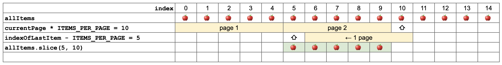

# 6. ページ送りを実装してみよう

いまのところ、商品一覧ページ（ http://localhost:3000 ）では、全ての商品を一つのページに表示しています。これをページにわけて（ページ送りで）表示してみましょう。

## やること1: ページ送りのボタンを作る

まずは素朴にページ送りします。 `src/app/page.tsx` では `allItems` に全ての商品を入れていますが、これをページごとに分割して表示するようにしたいです。

下記のようなコードで、`currentItems`には現在のページに表示すべき商品だけを入れて、これを `allItems`の代わりに使いましょう。

```tsx
export default async function Home({ searchParams }) {
  const params = await searchParams;
  const page = params.page;

  const allItems = items;

  const currentPage = page ? parseInt(page) : 1;

  const indexOfLastItem = currentPage * 5;
  const indexOfFirstItem = indexOfLastItem - 5;
  const currentItems = allItems.slice(indexOfFirstItem, indexOfLastItem);
```

そして、`</main>` の最後にページ送りのリンクを追加します。

```tsx
<div>
  <a href={`?page=${currentPage - 1}`}>前へ</a>
  <a href={`?page=${currentPage + 1}`}>次へ</a>
</div>
```

### 解説

#### searchParamsの取得

`await searchParams`でクエリパラメータが取得できます。これはNext.jsのApp Routerの機能です。

ドキュメント: https://nextjs.org/docs/app/api-reference/file-conventions/page#searchparams-optional

※ `await` は非同期処理を待つためのキーワードです。今回は詳しく触れませんが、JavaScript/TypeScriptを使っているとよく出てくるので、興味がある方は調べてみてください。

#### 三項演算子

```ts
const currentPage = page ? parseInt(page) : 1
```

は三項演算子と呼ばれる構文です。条件によって表示する内容を切り替えることができます。この場合、pageがあった場合はその値を数値に変換したもの、pageがなかった場合は1を`currentPage`に代入しています。

三項演算子なしで書くとこうなります。

```ts
let currentPage = 1;
if (page) {
  currentPage = parseInt(page);
}
```

簡潔に書けることがわかります。

また、ここでは `parseInt` を使って文字列を数値に変換しています。クエリパラメータは文字列として渡されるため、数値計算をする前に変換が必要です。

ドキュメント: https://developer.mozilla.org/ja/docs/Web/JavaScript/Reference/Global_Objects/parseInt

#### 四則演算

`+` `-` `*` `/` は四則演算です。これらは数値を計算するための演算子です。ここでは

```ts
const indexOfLastItem = currentPage * 5;
```

は現在のページと商品の表示数を掛け合わせて、表示する最後の商品のインデックス（配列中の何番目の要素か）を計算しています。

```ts
const indexOfFirstItem = indexOfLastItem - 5;
```

は最後の商品のインデックスから商品の表示数を引いて、表示する最初の商品のインデックスを計算しています。

#### 配列の一部を取り出す

`slice`メソッドを使うと配列から指定した範囲の要素を取り出せます。ブラウザのデベロッパーツールを使って、このコードを実行してみてください。

```ts
[1,2,3,4,5].slice(0, 2); // [1, 2]
[1,2,3,4,5].slice(2, 5); // [3, 4, 5]
```

今回の変更では、計算したインデックスを使って現在のページに表示すべき商品だけを取り出し、`currentItems`に代入しています。

```ts
const currentItems = allItems.slice(indexOfFirstItem, indexOfLastItem);
```

図で説明するとこんな感じです。

ドキュメント: https://developer.mozilla.org/ja/docs/Web/JavaScript/Reference/Global_Objects/Array/slice


## やること2: 最初のページと最後のページの表示を改善する

最初のページでは前へ、最後のページでは次へのリンクを表示しないようにしたいですね。

最初のページかどうかは `currentPage` が `1` かどうかで判断できます。また、最後のページかどうかはページ数 * 商品の表示数が全ての商品の数よりも大きいかどうかで判断できそうです。

このロジックを実装するため、`return`の前に最初のページかどうかを判断する`isFirstPage`と、最後のページかどうかを判断する`isLastPage`を定義します。

```ts
  const isFirstPage = currentPage === 1;
  const isLastPage = currentPage * 5 >= allItems.length;
```

そして、ページ送りのリンクで三項演算子を使って、条件によって表示する内容を切り替えます。

```tsx
      <div>
        {isFirstPage ? (<span>前へ</span>) : ( <a href={`?page=${currentPage - 1}`}>前へ</a> )}
        {isLastPage ? (<span>次へ</span>) : (<a href={`?page=${currentPage + 1}`}>次へ</a>)}
      </div>
    </main>
  );
}
```

### 解説

#### 表示の切り替え

`{ isFirstPage ? (省略) : (省略) }` のように、三項演算子を使うことで、条件によって表示する内容を切り替えています。

#### spanタグ

`<span>` は（リンクではない）テキストを表示するためのタグです。これを使うことで、リンクではなくテキストを表示することができます。
